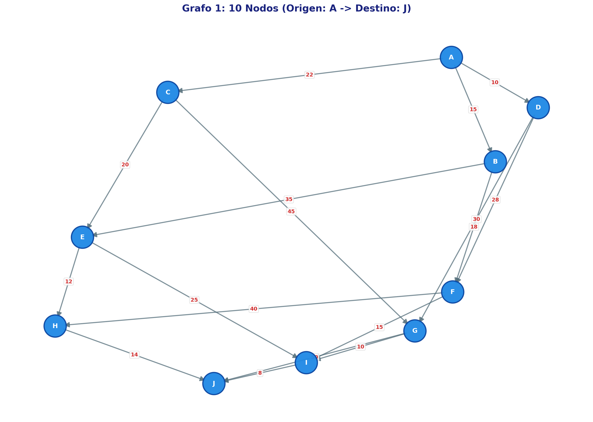
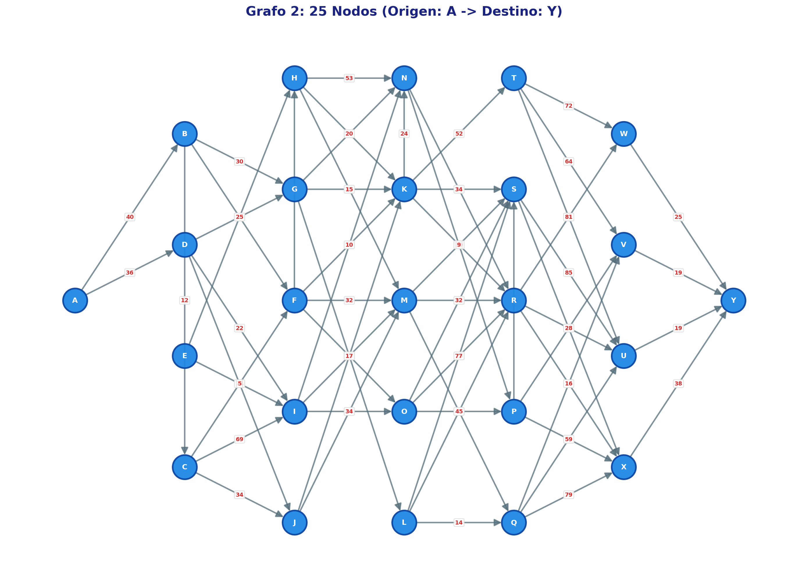
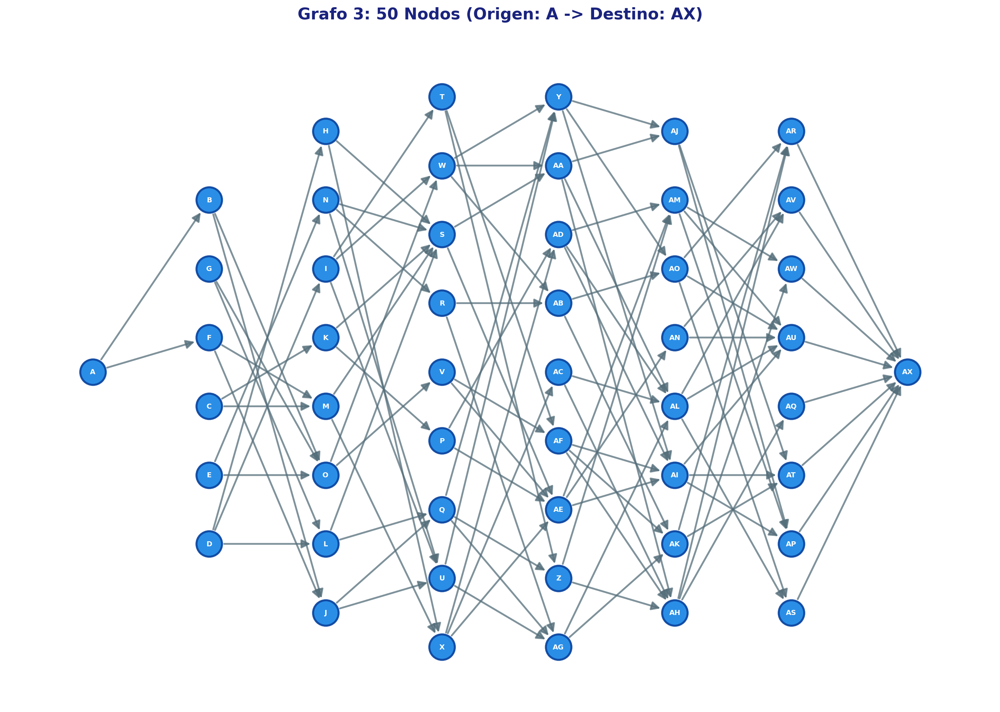

# Actividad 12. Algoritmos de búsqueda informada (heurísticos)

**Nombre de la actividad:** Actividad 12. Algoritmos de búsqueda informada (heurísticos): búsqueda
voraz y búsqueda A*

## Equipo

| Nombre completo | No. de cuenta |
|---|---|
| Jonathan Hernández Lazcano | 200417 |
| Camila Rodriguez Rosas | 194100 |

## Instrucciones

> 1. **Esquemas de entrada y salida (Pydantic).** Crear un esquema de validación para autenticar el
>    tipo de entrada, que incluya: matriz, lista o vector de adyacencia/con pesos del grafo a
>    analizar; origen y destino; límite de nodos a visitar (por defecto, 80 % del número total de
>    nodos).
> 2. **Algoritmos** (sin librerías adicionales o especializadas que los implementen):
>    - **Búsqueda voraz:** módulo `greedy_search.py` con un criterio de selección/evaluación (orden,
>      valor u otro).
>    - **Búsqueda estrella (A\*):** módulo `star_search.py` con la función de valor
>      `f(n) = g(n) + h(n)`, donde `g(n)` es el costo acumulado según los pesos conocidos y `h(n)`
>      la heurística (por ejemplo, la distancia euclidiana).
> 3. **Endpoints:** `POST /search/greedy` y `POST /search/star`.
> 4. **Salida (JSON):** No. total de nodos visitados, solución (True/False), ruta de solución, T(n)
>    y S(n). **Pruebas:** 3 por grafo, con distintos orígenes y destinos, en los grafos de 10, 25 y
>    50 nodos del archivo adjunto.
> 5. **Entregable:** archivo `.md` con bloque de identificación, nombre de la actividad,
>    documentación general de la implementación y pruebas efectuadas con sus resultados.

Los grafos de prueba son los de
[`txt/Actividad 12 (Nodos).txt`](txt/Actividad%2012%20(Nodos).txt), con sus imágenes en
[`img/`](img/).

## Descripción

API en **FastAPI** con dos endpoints que buscan una ruta entre dos nodos de un grafo ponderado:

| Endpoint | Algoritmo | Función de evaluación | ¿Ruta óptima? |
|---|---|---|---|
| `POST /search/greedy` | Búsqueda voraz (Greedy Best-First) | `f(n) = h(n)` | No garantizada |
| `POST /search/star` | Búsqueda A\* | `f(n) = g(n) + h(n)` | Sí, con `h` admisible |

Cada petición pasa por cuatro pasos:

1. **Validación** (`schemas.py`). Pydantic revisa el grafo, el origen, el destino, el límite y la
   heurística. Si algo no cuadra, la API responde `422` con el motivo.
2. **Normalización** (`core/grafos.py`). El grafo llega como lista de adyacencia, matriz de
   adyacencia o vector de aristas, y se convierte siempre a lista de adyacencia.
3. **Heurística** (`core/grafos.py`). Se calcula `h(n)` para todos los nodos: distancia euclidiana
   si la petición trae coordenadas, o heurística por saltos si no.
4. **Búsqueda** (`core/greedy_search.py` o `core/star_search.py`). El algoritmo devuelve la ruta, los
   nodos visitados, T(n), S(n) y la traza de nodos expandidos.

Los algoritmos están escritos a mano. Solo usan la biblioteca estándar de Python: `heapq` para la
cola de prioridad, `collections.deque`, `math` y `time`. **No** se usa networkx ni ninguna otra
librería de grafos.

## Cómo ejecutar

```bash
cd Actividad12-Algoritmos-De-Búsqueda-Informada-Heurísticos

python3 -m venv .venv
source .venv/bin/activate                     # Windows: .venv\Scripts\activate
pip install -r requirements.txt

# Levantar la API (documentación interactiva en http://127.0.0.1:8000/docs)
uvicorn main:app --reload

# Correr todas las pruebas de este documento (no necesita el servidor levantado)
python ejemplos/pruebas.py
```

## Estructura

```
Actividad12-Algoritmos-De-Búsqueda-Informada-Heurísticos/
├── main.py                 # App de FastAPI: monta el router de búsqueda y GET / (estado)
├── schemas.py              # Esquemas Pydantic de entrada (BusquedaRequest) y salida (BusquedaResponse)
├── core/                   # Lógica pura, sin dependencias de FastAPI
│   ├── grafos.py           # Construcción/validación del grafo, heurísticas y utilidades comunes
│   ├── greedy_search.py    # Búsqueda voraz
│   └── star_search.py      # Búsqueda A*
├── routers/
│   └── busqueda.py         # POST /search/greedy y POST /search/star
├── ejemplos/
│   ├── grafos.json         # Los 3 grafos del txt + coordenadas de los nodos medidas en las imágenes
│   ├── pruebas.py          # Corre todas las pruebas con el TestClient de FastAPI
│   └── resultados.json     # Respuestas completas de la API para cada prueba (generado)
├── img/                    # Imágenes de los grafos de 10, 25 y 50 nodos
├── txt/                    # Archivo con la estructura de los grafos
└── requirements.txt
```

## Esquemas de entrada y salida (Pydantic)

### Entrada: `BusquedaRequest`

El grafo se envía en **uno** de tres formatos. Enviar ninguno o más de uno es un error.

| Campo | Tipo | Obligatorio | Descripción |
|---|---|---|---|
| `lista_adyacencia` | `{nodo: [[vecino, peso], ...]}` | Uno de los tres | Mismo formato que el archivo de la actividad |
| `matriz_adyacencia` + `nodos` | `[[peso, ...], ...]` + `[nodo, ...]` | Uno de los tres | `matriz[i][j]` es el peso de `nodos[i] → nodos[j]`; `0` o `null` significa que no hay arista |
| `aristas` | `[[origen, destino, peso], ...]` | Uno de los tres | Vector de aristas |
| `origen` | texto | Sí | Nodo de inicio |
| `destino` | texto | Sí | Nodo a alcanzar |
| `limite_nodos` | entero ≥ 1 | No | Máximo de nodos a visitar. Por defecto, `⌈0.8 · n⌉`: 8, 20 y 40 en los grafos de prueba |
| `coordenadas` | `{nodo: [x, y]}` | Solo para la heurística euclidiana | Posición de cada nodo |
| `heuristica` | `"euclidiana"` \| `"saltos"` | No | Por defecto: `euclidiana` si se envían coordenadas; si no, `saltos` |
| `dirigido` | booleano | No (por defecto `true`) | Con `false`, cada arista se recorre en ambos sentidos |

Los mismos datos en los tres formatos (fragmento del grafo de 10 nodos):

```jsonc
// Lista de adyacencia
{ "lista_adyacencia": { "A": [["B", 15], ["C", 22], ["D", 10]], "B": [["E", 35], ["F", 18]], ... },
  "origen": "A", "destino": "J" }

// Matriz de adyacencia
{ "nodos": ["A", "B", "C", "D", ...],
  "matriz_adyacencia": [[0, 15, 22, 10, ...], [0, 0, 0, 0, 35, 18, ...], ...],
  "origen": "A", "destino": "J" }

// Vector de aristas
{ "aristas": [["A", "B", 15], ["A", "C", 22], ["A", "D", 10], ["B", "E", 35], ...],
  "origen": "A", "destino": "J" }
```

**Validaciones.** Pydantic revisa los tipos (por ejemplo, un peso `"x"` se rechaza). Después, un
`model_validator` comprueba lo siguiente:

| Regla | Mensaje (respuesta 422) |
|---|---|
| Exactamente un formato de grafo | `Envía exactamente un formato de grafo: ...` |
| La matriz trae `nodos`, sin repetidos, y es cuadrada de n×n | `La matriz debe ser cuadrada de 2×2: ...` |
| Pesos ≥ 0 (A\* no admite pesos negativos) | `La arista A → B tiene peso negativo (-1); ...` |
| `origen` y `destino` existen en el grafo | `El origen 'Z' no es un nodo del grafo.` |
| La heurística euclidiana trae coordenadas para **todos** los nodos | `Faltan coordenadas para: B, C, ...` |
| `limite_nodos ≥ 1` | `Input should be greater than or equal to 1` |

Los nodos que solo aparecen como destino de una arista se agregan al grafo sin aristas de salida,
como `J` en el grafo de 10 nodos. Si una arista viene repetida, se conserva el peso menor.

### Salida: `BusquedaResponse`

| Campo | Tipo | Descripción |
|---|---|---|
| `algoritmo` | texto | `Búsqueda voraz (Greedy Best-First)` o `Búsqueda A*` |
| `criterio` | texto | `f(n) = h(n)` o `f(n) = g(n) + h(n)` |
| `heuristica` | objeto | `tipo`, `formula` (con la escala usada) y `escala` |
| `origen`, `destino`, `limite_nodos` | | Valores usados, incluido el límite por defecto |
| **`nodos_visitados`** | entero | **No. total de nodos visitados**, es decir, expandidos (incluye el origen y el destino) |
| **`solucion`** | booleano | **Solución** `true`/`false` |
| **`ruta`** | lista | **Ruta de solución**; vacía si no se encontró |
| `costo` | número \| `null` | Suma de los pesos de la ruta |
| `motivo` | texto | Si llegó al destino, si alcanzó el límite o si no existe camino |
| **`T(n)`** | objeto | **Complejidad temporal**: `notacion`, `b`, `profundidad`, `cota` = b^profundidad, `nodos_generados`, `tiempo_ms` |
| **`S(n)`** | objeto | **Complejidad espacial**: `notacion`, `b`, `profundidad`, `cota`, `max_frontera`, `max_nodos_en_memoria` |
| `traza` | lista | Cada nodo en el orden en que se visitó, con sus valores `g`, `h` y `f` |

Los campos en negritas son los que pide la actividad. En Python se llaman `T_n` y `S_n`, y se
publican con los alias `T(n)` y `S(n)`. Si desde un nodo no se puede llegar al destino, su `h` es
∞; JSON no tiene infinito, así que en la traza aparece como `null`.

## Heurísticas

El archivo de la actividad solo trae aristas y pesos, no la posición de los nodos. Por eso la API
ofrece dos heurísticas, y las dos son **admisibles** (nunca sobreestiman el costo real) y
**consistentes**: para toda arista u → v se cumple `h(u) ≤ w(u, v) + h(v)`.

### Distancia euclidiana

```
h(n) = k · d(n, destino)        k = mín { w(u, v) / d(u, v) : u → v es arista del grafo }
```

`d` es la distancia euclidiana entre las coordenadas. Las coordenadas están en otra unidad que los
pesos (píxeles contra costo), así que hay que escalarlas. Sin esa escala, `h` sería mucho mayor que
los costos reales y A\* dejaría de garantizar la ruta óptima. Con `k` igual a la menor razón
peso/distancia del grafo:

- `k · d(u, v) ≤ w(u, v)` para toda arista.
- Por la desigualdad del triángulo, `h(u) ≤ k · d(u, v) + h(v) ≤ w(u, v) + h(v)`. Es decir, la
  heurística es consistente y por lo tanto admisible.

Las **coordenadas** de los tres grafos están en [`ejemplos/grafos.json`](ejemplos/grafos.json). Son
las posiciones aproximadas, en píxeles, de cada nodo en las imágenes de `img/` (medidas sobre la
imagen escalada a 2000 px de ancho; el eje y crece hacia abajo).

### Por saltos

```
h(n) = w_min · saltos(n, destino)
```

`saltos` es el menor número de aristas para llegar al destino. Se calcula con un recorrido BFS desde
el destino sobre el grafo con las aristas invertidas. `w_min` es el peso más pequeño del grafo.

- Cada arista cuesta al menos `w_min`, así que nunca sobreestima.
- Como `saltos(u) ≤ 1 + saltos(v)`, se cumple `h(u) ≤ w_min + h(v) ≤ w(u, v) + h(v)`: también es
  consistente.
- Los nodos desde los que no se llega al destino reciben `h = ∞`.

Esta heurística no necesita coordenadas, así que sirve con cualquier grafo.

### Valores en los grafos de prueba

| Grafo | Euclidiana: `k` | Arista que fija `k` | Por saltos: `w_min` |
|---|---|---|---|
| 10 nodos | 0.02286 | A → C (peso 22, 962 px) | 8 |
| 25 nodos | 0.01629 | J → M (peso 10, 614 px) | 5 |
| 50 nodos | 0.04666 | AR → AX (peso 25, 536 px) | 12 |

## Algoritmos

Los dos algoritmos comparten la misma estructura. Se diferencian en **qué valor ordena la frontera**.

| | Voraz | A\* |
|---|---|---|
| Prioridad en la frontera | `(h, g, orden de inserción)` | `(g + h, g, orden de inserción)` |
| ¿Se actualiza un nodo ya generado si aparece un camino más barato? | No | Sí, se reinserta con el nuevo `g` |
| ¿Garantiza la ruta óptima? | No | Sí, con `h` admisible |

### Búsqueda voraz: `core/greedy_search.py`

**Criterio de selección/evaluación:** `f(n) = h(n)`. Se expande el nodo de la frontera que la
heurística estima **más cercano al destino**, sin importar cuánto costó llegar a él. Si dos nodos
empatan en `h`, se elige el de menor costo acumulado `g`; si también empatan, el que entró primero a
la frontera.

```
frontera ← {origen}                         (cola de prioridad por h)
mientras la frontera no esté vacía:
    u ← sacar el nodo con menor h
    marcar u como visitado
    si u = destino            → solución: reconstruir la ruta con los padres
    si visitados = límite     → sin solución: se alcanzó el límite
    para cada arista u → v:
        si v no se ha generado: padre[v] ← u, meter v a la frontera
sin solución: no existe camino
```

Es búsqueda en grafo: un nodo ya generado no se vuelve a meter, aunque luego aparezca un camino más
barato hacia él. Por eso visita pocos nodos, pero puede devolver una ruta más cara que la óptima.

### Búsqueda A\*: `core/star_search.py`

**Función de valor:** `f(n) = g(n) + h(n)`.

- `g(n)` es el costo acumulado desde el origen, la suma de los pesos conocidos.
- `h(n)` es la heurística.

Se expande el nodo con menor `f`. A igual `f` se prefiere el de menor `g`, y después el que entró
primero.

```
frontera ← {origen},  g[origen] ← 0          (cola de prioridad por g + h)
mientras la frontera no esté vacía:
    u ← sacar el nodo con menor f   (si es una entrada vieja, se descarta)
    marcar u como visitado
    si u = destino            → solución
    si visitados = límite     → sin solución: se alcanzó el límite
    para cada arista u → v con peso w:
        si g[u] + w < g[v]:
            g[v] ← g[u] + w,  padre[v] ← u,  meter v con f = g[v] + h(v)
sin solución: no existe camino
```

Si aparece un camino más barato hacia un nodo que ya se visitó, ese nodo se **reabre**. Con las dos
heurísticas de la API esto nunca pasa, porque son consistentes. Pero así A\* sigue devolviendo la
ruta óptima si alguien usa una heurística admisible que no sea consistente.

### Límite de nodos y nodos visitados

- Un nodo se cuenta como **visitado** cuando se saca de la frontera y se evalúa. Los nodos que solo
  se generaron (entraron a la frontera) no cuentan.
- El límite es el número máximo de nodos visitados. Por defecto vale el 80 % del total de nodos,
  redondeado hacia arriba.
- La prueba de meta se hace antes de revisar el límite, así que el destino puede ser justo el
  último nodo permitido.
- Si se llega al límite sin encontrar el destino, la respuesta trae `solucion: false` y el motivo
  correspondiente.

### T(n) y S(n)

Cada respuesta incluye la complejidad **teórica**, con los valores de esa ejecución, y lo
**medido**:

| | Voraz | A\* |
|---|---|---|
| Notación teórica | `T(n) = S(n) = O(b^m)` | `T(n) = S(n) = O(b^d)` |
| `b` | Factor de ramificación máximo: el mayor número de sucesores entre los nodos alcanzables desde el origen | igual |
| `profundidad` | `m`: profundidad máxima del espacio de búsqueda, es decir, el camino más largo desde el origen | `d`: profundidad (aristas) de la solución encontrada; sin solución, la mayor profundidad alcanzada |
| `cota` | `b^m` | `b^d` |
| T(n) medida | `nodos_generados` (inserciones en la frontera) y `tiempo_ms` (duración del ciclo de búsqueda) | igual |
| S(n) medida | `max_frontera` y `max_nodos_en_memoria` (el mayor valor de frontera + explorados) | igual |

`O(b^m)` y `O(b^d)` son las cotas de peor caso del libro de texto para búsqueda en árbol. Aquí se
lleva el conjunto de explorados, así que ningún nodo se expande dos veces. Por eso los valores
medidos quedan muy por debajo de la cota. En un grafo explícito con un *heap* binario, la cota real
es `O((V + E) log V)` en tiempo y `O(V)` en memoria.

Un ejemplo: en el grafo de 25 nodos, el camino más largo desde A tiene 12 aristas
(A → B → D → E → C → I → O → L → Q → R → T → W → Y). Así que la cota de la voraz es
3¹² = 531 441, pero en la prueba A → Y solo generó 15 nodos.

`tiempo_ms` cambia en cada ejecución (son centésimas de milisegundo), así que los tiempos de las
tablas son de una corrida en particular.

## Endpoints

| Endpoint | Descripción |
|---|---|
| `GET /` | Verificación de estado (`{"status": "ok"}`) |
| `POST /search/greedy` | Búsqueda voraz |
| `POST /search/star` | Búsqueda A\* |

Los dos endpoints de búsqueda reciben el mismo cuerpo (`BusquedaRequest`) y devuelven la misma
estructura (`BusquedaResponse`). Respuestas posibles:

- `200`: la búsqueda terminó, con solución o sin ella. Ver `solucion` y `motivo`.
- `422`: entrada inválida.

### Cómo llamarlos

**Con `curl`** (con la API levantada):

```bash
curl -X POST "http://127.0.0.1:8000/search/star" \
     -H "Content-Type: application/json" \
     -d '{
           "lista_adyacencia": {
             "A": [["B", 15], ["C", 22], ["D", 10]], "B": [["E", 35], ["F", 18]],
             "C": [["E", 20], ["G", 45]], "D": [["F", 28], ["G", 30]],
             "E": [["H", 12], ["I", 25]], "F": [["H", 40], ["I", 15]],
             "G": [["I", 10], ["J", 50]], "H": [["J", 14]], "I": [["J", 8]], "J": []
           },
           "origen": "A",
           "destino": "J"
         }'
```

**Desde Swagger** (`http://127.0.0.1:8000/docs`):

1. Abrir el grupo **Búsqueda informada** y elegir un endpoint.
2. Pulsar *Try it out*.
3. Escoger uno de los ejemplos precargados: grafo de 10 nodos con heurística por saltos, con
   heurística euclidiana, como matriz de adyacencia, o como vector de aristas con límite.
4. Pulsar *Execute*.

**Desde Python**, con un grafo de `ejemplos/grafos.json`:

```python
import json
import httpx

grafo = json.load(open("ejemplos/grafos.json"))["grafo-25"]
r = httpx.post(
    "http://127.0.0.1:8000/search/greedy",
    json={
        "lista_adyacencia": grafo["lista_adyacencia"],
        "coordenadas": grafo["coordenadas"],      # → heurística euclidiana
        "origen": "A",
        "destino": "Y",
    },
)
print(r.json()["ruta"])   # ['A', 'D', 'F', 'M', 'R', 'U', 'Y']
```

## Pruebas

Todas las pruebas se corren con [`ejemplos/pruebas.py`](ejemplos/pruebas.py), que llama a la API en
memoria con el `TestClient` de FastAPI. Las respuestas completas, con la traza de cada búsqueda,
quedan en [`ejemplos/resultados.json`](ejemplos/resultados.json). El script también **comprueba**
los resultados y falla si algo no cuadra:

- El costo de A\* es igual al óptimo real, calculado por fuerza bruta recorriendo todos los caminos
  simples (esto solo se hace dentro del script de prueba).
- La voraz nunca da un costo menor que el óptimo.
- Ningún algoritmo visita más nodos que el límite.

### Grafos

| Grafo | Nodos | Aristas | Pesos | Origen → destino de la imagen | Notas |
|---|---|---|---|---|---|
| [10 nodos](img/grafo-10-nodos.png) | 10 | 17 | 8 – 50 | A → J | Todos los nodos son alcanzables desde A |
| [25 nodos](img/grafo-25-nodos.png) | 25 | 45 | 5 – 85 | A → Y | Hay aristas dentro de una misma columna (B → D, D → E, E → C, G → F, ...) |
| [50 nodos](img/grafo-50-nodos.png) | 50 | 56 | 12 – 68 | A → AX | Poco denso. Tiene 9 nodos sin aristas de entrada (A, D, E, Q, T, Z, AB, AI, AQ), y desde A solo se alcanzan 22 nodos |

Los tres grafos son dirigidos y tienen un único nodo sin salida (J, Y y AX), que es el destino de
sus imágenes.

<p align="center">
  
  
  
</p>

### Escenarios

En cada grafo hay 3 pruebas con distintos orígenes y destinos. La primera es la que marca la imagen.
Las otras dos se eligieron para que la ruta tenga al menos dos aristas y para que se note la
diferencia entre los algoritmos. Cada prueba se corre con los **2 algoritmos × 2 heurísticas**, así
que son 36 búsquedas en total, todas con el límite por defecto del 80 %.

| Grafo | Prueba 1 | Prueba 2 | Prueba 3 | Límite |
|---|---|---|---|---|
| 10 nodos | A → J | D → J | B → H | 8 |
| 25 nodos | A → Y | B → P | D → Q | 20 |
| 50 nodos | A → AX | D → AS | B → AA | 40 |

### Resumen de resultados

Costo de la ruta encontrada y, entre paréntesis, nodos visitados. **Óptimo** es el costo mínimo real,
calculado por fuerza bruta.

| Grafo | Prueba | Óptimo | Voraz (euclidiana) | Voraz (saltos) | A* (euclidiana) | A* (saltos) |
|---|---|---|---|---|---|---|
| 10 nodos | A → J | 56 | 75 (5 visitados) | 90 (4 visitados) | **56** (7 visitados) | **56** (8 visitados) |
| 10 nodos | D → J | 48 | 80 (3 visitados) | 80 (3 visitados) | **48** (5 visitados) | **48** (5 visitados) |
| 10 nodos | B → H | 47 | **47** (3 visitados) | 58 (3 visitados) | **47** (3 visitados) | **47** (4 visitados) |
| 25 nodos | A → Y | 115 | 160 (7 visitados) | 142 (7 visitados) | **115** (18 visitados) | **115** (19 visitados) |
| 25 nodos | B → P | 91 | 139 (5 visitados) | 96 (5 visitados) | **91** (18 visitados) | **91** (10 visitados) |
| 25 nodos | D → Q | 77 | 82 (5 visitados) | 82 (5 visitados) | **77** (13 visitados) | **77** (7 visitados) |
| 50 nodos | A → AX | 181 | 224 (8 visitados) | **181** (8 visitados) | **181** (19 visitados) | **181** (19 visitados) |
| 50 nodos | D → AS | 220 | 262 (6 visitados) | **220** (6 visitados) | **220** (8 visitados) | **220** (8 visitados) |
| 50 nodos | B → AA | 111 | 128 (4 visitados) | **111** (4 visitados) | **111** (5 visitados) | **111** (5 visitados) |

En negritas, las búsquedas que dieron la ruta óptima. Las 36 búsquedas encontraron solución
(`solucion: true`).

### Resultados detallados: grafo de 10 nodos

| Prueba | Algoritmo | Heurística | Solución | Ruta | Costo | Visitados / límite | T(n) | S(n) |
|---|---|---|---|---|---|---|---|---|
| A → J | Voraz | euclidiana | True | A → C → E → I → J | 75 | 5 / 8 | O(3^4) = 81 · 9 generados · 0.0155 ms | O(3^4) = 81 · 9 en memoria (frontera máx. 5) |
| A → J | A* | euclidiana | True | A → B → F → I → J | 56 | 7 / 8 | O(3^4) = 81 · 11 generados · 0.0172 ms | O(3^4) = 81 · 10 en memoria (frontera máx. 4) |
| A → J | Voraz | saltos | True | A → D → G → J | 90 | 4 / 8 | O(3^4) = 81 · 8 generados · 0.0074 ms | O(3^4) = 81 · 8 en memoria (frontera máx. 5) |
| A → J | A* | saltos | True | A → B → F → I → J | 56 | 8 / 8 | O(3^4) = 81 · 13 generados · 0.0149 ms | O(3^4) = 81 · 10 en memoria (frontera máx. 4) |
| D → J | Voraz | euclidiana | True | D → G → J | 80 | 3 / 8 | O(2^3) = 8 · 5 generados · 0.0055 ms | O(2^3) = 8 · 5 en memoria (frontera máx. 3) |
| D → J | A* | euclidiana | True | D → G → I → J | 48 | 5 / 8 | O(2^3) = 8 · 7 generados · 0.0078 ms | O(2^3) = 8 · 6 en memoria (frontera máx. 3) |
| D → J | Voraz | saltos | True | D → G → J | 80 | 3 / 8 | O(2^3) = 8 · 5 generados · 0.0047 ms | O(2^3) = 8 · 5 en memoria (frontera máx. 3) |
| D → J | A* | saltos | True | D → G → I → J | 48 | 5 / 8 | O(2^3) = 8 · 7 generados · 0.0097 ms | O(2^3) = 8 · 6 en memoria (frontera máx. 3) |
| B → H | Voraz | euclidiana | True | B → E → H | 47 | 3 / 8 | O(2^3) = 8 · 5 generados · 0.0048 ms | O(2^3) = 8 · 5 en memoria (frontera máx. 3) |
| B → H | A* | euclidiana | True | B → E → H | 47 | 3 / 8 | O(2^2) = 4 · 5 generados · 0.0061 ms | O(2^2) = 4 · 5 en memoria (frontera máx. 3) |
| B → H | Voraz | saltos | True | B → F → H | 58 | 3 / 8 | O(2^3) = 8 · 5 generados · 0.0047 ms | O(2^3) = 8 · 5 en memoria (frontera máx. 3) |
| B → H | A* | saltos | True | B → E → H | 47 | 4 / 8 | O(2^2) = 4 · 6 generados · 0.0074 ms | O(2^2) = 4 · 5 en memoria (frontera máx. 3) |

### Resultados detallados: grafo de 25 nodos

| Prueba | Algoritmo | Heurística | Solución | Ruta | Costo | Visitados / límite | T(n) | S(n) |
|---|---|---|---|---|---|---|---|---|
| A → Y | Voraz | euclidiana | True | A → D → F → M → R → U → Y | 160 | 7 / 20 | O(3^12) = 531441 · 15 generados · 0.0106 ms | O(3^12) = 531441 · 15 en memoria (frontera máx. 9) |
| A → Y | A* | euclidiana | True | A → D → F → K → R → U → Y | 115 | 18 / 20 | O(3^6) = 729 · 24 generados · 0.0266 ms | O(3^6) = 729 · 22 en memoria (frontera máx. 9) |
| A → Y | Voraz | saltos | True | A → D → I → M → R → U → Y | 142 | 7 / 20 | O(3^12) = 531441 · 14 generados · 0.0099 ms | O(3^12) = 531441 · 14 en memoria (frontera máx. 8) |
| A → Y | A* | saltos | True | A → D → F → K → R → U → Y | 115 | 19 / 20 | O(3^6) = 729 · 25 generados · 0.0273 ms | O(3^6) = 729 · 23 en memoria (frontera máx. 9) |
| B → P | Voraz | euclidiana | True | B → G → F → M → P | 139 | 5 / 20 | O(3^11) = 177147 · 9 generados · 0.0088 ms | O(3^11) = 177147 · 9 en memoria (frontera máx. 5) |
| B → P | A* | euclidiana | True | B → D → E → I → M → P | 91 | 18 / 20 | O(3^5) = 243 · 24 generados · 0.2158 ms | O(3^5) = 243 · 22 en memoria (frontera máx. 9) |
| B → P | Voraz | saltos | True | B → D → I → M → P | 96 | 5 / 20 | O(3^11) = 177147 · 10 generados · 0.0074 ms | O(3^11) = 177147 · 10 en memoria (frontera máx. 6) |
| B → P | A* | saltos | True | B → D → E → I → M → P | 91 | 10 / 20 | O(3^5) = 243 · 16 generados · 0.0149 ms | O(3^5) = 243 · 15 en memoria (frontera máx. 6) |
| D → Q | Voraz | euclidiana | True | D → I → O → L → Q | 82 | 5 / 20 | O(3^10) = 59049 · 9 generados · 0.0075 ms | O(3^10) = 59049 · 9 en memoria (frontera máx. 5) |
| D → Q | A* | euclidiana | True | D → E → I → O → L → Q | 77 | 13 / 20 | O(3^5) = 243 · 22 generados · 0.0196 ms | O(3^5) = 243 · 20 en memoria (frontera máx. 9) |
| D → Q | Voraz | saltos | True | D → I → O → L → Q | 82 | 5 / 20 | O(3^10) = 59049 · 9 generados · 0.0070 ms | O(3^10) = 59049 · 9 en memoria (frontera máx. 5) |
| D → Q | A* | saltos | True | D → E → I → O → L → Q | 77 | 7 / 20 | O(3^5) = 243 · 12 generados · 0.0120 ms | O(3^5) = 243 · 11 en memoria (frontera máx. 5) |

### Resultados detallados: grafo de 50 nodos

| Prueba | Algoritmo | Heurística | Solución | Ruta | Costo | Visitados / límite | T(n) | S(n) |
|---|---|---|---|---|---|---|---|---|
| A → AX | Voraz | euclidiana | True | A → C → M → V → AF → AL → AU → AX | 224 | 8 / 40 | O(3^8) = 6561 · 11 generados · 0.0124 ms | O(3^8) = 6561 · 11 en memoria (frontera máx. 4) |
| A → AX | A* | euclidiana | True | A → F → K → R → AD → AM → AV → AX | 181 | 19 / 40 | O(3^7) = 2187 · 20 generados · 0.0242 ms | O(3^7) = 2187 · 20 en memoria (frontera máx. 5) |
| A → AX | Voraz | saltos | True | A → F → K → R → AD → AM → AV → AX | 181 | 8 / 40 | O(3^8) = 6561 · 11 generados · 0.0099 ms | O(3^8) = 6561 · 11 en memoria (frontera máx. 4) |
| A → AX | A* | saltos | True | A → F → K → R → AD → AM → AV → AX | 181 | 19 / 40 | O(3^7) = 2187 · 20 generados · 0.0240 ms | O(3^7) = 2187 · 20 en memoria (frontera máx. 5) |
| D → AS | Voraz | euclidiana | True | D → J → X → AG → AH → AS | 262 | 6 / 40 | O(2^6) = 64 · 7 generados · 0.0077 ms | O(2^6) = 64 · 7 en memoria (frontera máx. 2) |
| D → AS | A* | euclidiana | True | D → L → U → AG → AH → AS | 220 | 8 / 40 | O(2^5) = 32 · 8 generados · 0.0141 ms | O(2^5) = 32 · 8 en memoria (frontera máx. 2) |
| D → AS | Voraz | saltos | True | D → L → U → AG → AH → AS | 220 | 6 / 40 | O(2^6) = 64 · 7 generados · 0.0078 ms | O(2^6) = 64 · 7 en memoria (frontera máx. 2) |
| D → AS | A* | saltos | True | D → L → U → AG → AH → AS | 220 | 8 / 40 | O(2^5) = 32 · 8 generados · 0.0114 ms | O(2^5) = 32 · 8 en memoria (frontera máx. 2) |
| B → AA | Voraz | euclidiana | True | B → H → S → AA | 128 | 4 / 40 | O(2^6) = 64 · 5 generados · 0.0058 ms | O(2^6) = 64 · 5 en memoria (frontera máx. 2) |
| B → AA | A* | euclidiana | True | B → I → S → AA | 111 | 5 / 40 | O(2^3) = 8 · 5 generados · 0.0085 ms | O(2^3) = 8 · 5 en memoria (frontera máx. 2) |
| B → AA | Voraz | saltos | True | B → I → S → AA | 111 | 4 / 40 | O(2^6) = 64 · 5 generados · 0.0056 ms | O(2^6) = 64 · 5 en memoria (frontera máx. 2) |
| B → AA | A* | saltos | True | B → I → S → AA | 111 | 5 / 40 | O(2^3) = 8 · 5 generados · 0.0078 ms | O(2^3) = 8 · 5 en memoria (frontera máx. 2) |

### Recorrido paso a paso: grafo de 10 nodos, A → J, heurística euclidiana

Este caso muestra por qué la voraz falla y A\* no. Con `k = 0.02286`, los valores de `h` son
A = 31.13, B = 27.64, C = 22.77, D = 32.84, E = 15.17, F = 19.71, I = 7.29 y J = 0.

**Voraz** (`f = h`):

| Paso | Nodo visitado | g | h = f |
|---|---|---|---|
| 1 | A | 0 | 31.13 |
| 2 | C | 22 | 22.77 |
| 3 | E | 42 | 15.17 |
| 4 | I | 67 | 7.29 |
| 5 | J | 75 | 0 |

- Desde A, el nodo con menor `h` es C (22.77, contra 27.64 de B y 32.84 de D), así que la voraz se
  va por C.
- Después sigue lo que parece más cercano a J: E y luego I.
- El resultado es la ruta **A → C → E → I → J, de costo 75**. Nunca considera que A → C → E ya
  costó 42.

**A\*** (`f = g + h`):

| Paso | Nodo visitado | g | h | f |
|---|---|---|---|---|
| 1 | A | 0 | 31.13 | 31.13 |
| 2 | B | 15 | 27.64 | 42.64 |
| 3 | D | 10 | 32.84 | 42.84 |
| 4 | C | 22 | 22.77 | 44.77 |
| 5 | F | 33 | 19.71 | 52.71 |
| 6 | I | 48 | 7.29 | 55.29 |
| 7 | J | 56 | 0 | 56.00 |

- A\* también ve que C parece cercano a J, pero su `f = 22 + 22.77 = 44.77` es mayor que el de B y
  el de D.
- A\* visita C (paso 4), pero E queda con `f = 42 + 15.17 = 57.17`. Eso es más que el `f` de la ruta
  por F e I, así que A\* nunca visita E.
- Llega a J por **A → B → F → I → J, de costo 56**, el óptimo. Para eso visitó 7 nodos en vez de 5.

### Ejemplo de respuesta completa

`POST /search/star` con el grafo de 10 nodos, sus coordenadas, origen `A` y destino `J`:

```json
{
  "algoritmo": "Búsqueda A*",
  "criterio": "f(n) = g(n) + h(n)",
  "heuristica": {
    "tipo": "euclidiana",
    "formula": "h(n) = 0.02286 · distancia_euclidiana(n, J)",
    "escala": 0.022863
  },
  "origen": "A",
  "destino": "J",
  "limite_nodos": 8,
  "nodos_visitados": 7,
  "solucion": true,
  "ruta": ["A", "B", "F", "I", "J"],
  "costo": 56.0,
  "motivo": "Se llegó a J con costo 56.",
  "T(n)": {
    "notacion": "O(b^d)",
    "b": 3,
    "profundidad": 4,
    "cota": 81,
    "nodos_generados": 11,
    "tiempo_ms": 0.0172
  },
  "S(n)": {
    "notacion": "O(b^d)",
    "b": 3,
    "profundidad": 4,
    "cota": 81,
    "max_frontera": 4,
    "max_nodos_en_memoria": 10
  },
  "traza": [
    { "nodo": "A", "g": 0.0,  "h": 31.1337, "f": 31.1337 },
    { "nodo": "B", "g": 15.0, "h": 27.6404, "f": 42.6404 },
    { "nodo": "D", "g": 10.0, "h": 32.8403, "f": 42.8403 },
    { "nodo": "C", "g": 22.0, "h": 22.7744, "f": 44.7744 },
    { "nodo": "F", "g": 33.0, "h": 19.7138, "f": 52.7138 },
    { "nodo": "I", "g": 48.0, "h": 7.2882,  "f": 55.2882 },
    { "nodo": "J", "g": 56.0, "h": 0.0,     "f": 56.0 }
  ]
}
```

## Casos adicionales

Estos casos muestran respuestas con `solucion: false` y los errores de validación. También los corre
`ejemplos/pruebas.py`.

| Prueba | Algoritmo | Heurística | Solución | Ruta | Costo | Visitados / límite | T(n) | S(n) |
|---|---|---|---|---|---|---|---|---|
| 10 nodos: J → A | Voraz | saltos | False | — | — | 1 / 8 | O(0^0) = 1 · 1 generados · 0.0017 ms | O(0^0) = 1 · 1 en memoria (frontera máx. 1) |
| 10 nodos: J → A | A* | saltos | False | — | — | 1 / 8 | O(0^0) = 1 · 1 generados · 0.0019 ms | O(0^0) = 1 · 1 en memoria (frontera máx. 1) |
| 25 nodos: B → T | Voraz | euclidiana | True | B → G → K → N → T | 121 | 5 / 20 | O(3^11) = 177147 · 10 generados · 0.0075 ms | O(3^11) = 177147 · 10 en memoria (frontera máx. 6) |
| 25 nodos: B → T | A* | euclidiana | **False** | — | — | 20 / 20 | O(3^6) = 729 · 24 generados · 0.0265 ms | O(3^6) = 729 · 23 en memoria (frontera máx. 8) |
| 25 nodos: B → T | Voraz | saltos | True | B → G → K → R → T | 118 | 5 / 20 | O(3^11) = 177147 · 12 generados · 0.0075 ms | O(3^11) = 177147 · 12 en memoria (frontera máx. 8) |
| 25 nodos: B → T | A* | saltos | True | B → G → K → R → T | 118 | 17 / 20 | O(3^4) = 81 · 23 generados · 0.0231 ms | O(3^4) = 81 · 22 en memoria (frontera máx. 9) |
| 50 nodos: A → AX, límite 5 | Voraz | saltos | False | — | — | 5 / 5 | O(3^8) = 6561 · 8 generados · 0.0072 ms | O(3^8) = 6561 · 8 en memoria (frontera máx. 4) |
| 50 nodos: A → AX, límite 5 | A* | saltos | False | — | — | 5 / 5 | O(3^3) = 27 · 9 generados · 0.0092 ms | O(3^3) = 27 · 9 en memoria (frontera máx. 5) |

1. **No existe camino (10 nodos, J → A).** J no tiene aristas de salida. Los dos algoritmos visitan
   J, se quedan sin frontera y responden con el motivo `"Se exploraron todos los nodos alcanzables
   desde J y A no está entre ellos: no existe camino."`. Como J no tiene sucesores, `b = 0` y
   `profundidad = 0`.
2. **El límite del 80 % frente a la calidad de la heurística (25 nodos, B → T).**
   - Con la heurística euclidiana, A\* llega al límite de 20 nodos sin alcanzar T y responde
     `"Se alcanzó el límite de 20 nodos visitados sin llegar a T."`.
   - Con la heurística por saltos, A\* encuentra la ruta óptima (118) visitando 17 nodos.
   - La causa es que la escala euclidiana del grafo de 25 nodos es muy pequeña (`k = 0.01629`, fijada
     por J → M, una arista de peso 10 entre nodos separados 614 px). Con una `h` tan baja, A\* se
     parece a Dijkstra y casi agota el grafo.
   - La voraz, que visita pocos nodos, sí llega en los dos casos, aunque con la heurística euclidiana
     da una ruta más cara (121).
3. **Límite personalizado (50 nodos, A → AX con `limite_nodos: 5`).** La ruta tiene 7 aristas, así
   que con 5 nodos visitados ningún algoritmo llega. Los dos se detienen exactamente en el límite.
4. **Matriz de adyacencia.** El grafo de 10 nodos enviado como matriz da exactamente la misma
   solución, ruta, costo, nodos visitados y traza que enviado como lista de adyacencia.
5. **Errores de validación (422).**
   - Origen inexistente → `"El origen 'Z' no es un nodo del grafo."`
   - `"heuristica": "euclidiana"` sin coordenadas → ``"La heurística euclidiana requiere
     `coordenadas`: una posición [x, y] por nodo."``

## Observaciones

- **A\* encontró siempre la ruta óptima:** 18 de 18 búsquedas, con las dos heurísticas. El script lo
  comprobó contra la fuerza bruta.
- **La voraz solo acertó en 4 de 18 búsquedas.** Llegó a costar hasta 67 % más que el óptimo
  (10 nodos, D → J: 80 contra 48). Se va directo a lo que parece más cercano al destino y no
  reconsidera.
- **A cambio, la voraz visita muchos menos nodos.** En A → Y (25 nodos) visitó 7 nodos, contra 18–19
  de A\*. En los tres grafos nunca pasó de 8 nodos visitados.
- **La calidad de la heurística determina cuánto trabaja A\*.**
  - En el grafo de 25 nodos, la heurística por saltos le ahorró casi la mitad de las visitas a A\*
    (B → P: 10 contra 18; D → Q: 7 contra 13).
  - En el caso B → T, la heurística euclidiana es tan débil que A\* llega al límite y no da solución.
  - Una heurística más alta, sin dejar de ser admisible, poda más.
- **El grafo de 50 nodos es poco denso.** Casi todos los nodos tienen una sola salida, y desde A
  solo se alcanzan 22 nodos. Por eso, aunque es el más grande, las búsquedas visitan pocos nodos y
  el límite de 40 nunca se acerca.
- **Las cotas teóricas son pesimistas.** `O(b^m)` supone un árbol de búsqueda sin control de
  repetidos. Con el conjunto de explorados, los nodos generados nunca pasaron de 25 (A → Y con A\*),
  mientras que la cota llegó a 531 441.

## Limitaciones

- **Las imágenes no coinciden del todo con el txt.**
  - Las imágenes de 25 y 50 nodos dibujan aristas que no aparecen en el archivo. Por ejemplo, la de
    25 tiene aristas de peso 77 y 81, y en la de 50 el nodo A no tiene la arista A → C.
  - La imagen de 50 nodos no muestra pesos.
  - Como pide la actividad, la estructura de los grafos se tomó del **archivo adjunto**. De las
    imágenes solo se usaron las posiciones de los nodos.
- **Las coordenadas son aproximadas:** se midieron a ojo sobre las imágenes. Como la heurística se
  escala con `k`, un error pequeño en una posición cambia un poco los valores de `h`, pero la
  heurística sigue siendo admisible.
- **Pesos.** Se requieren pesos ≥ 0. En la matriz de adyacencia, una arista de peso 0 no se puede
  representar, porque 0 significa "sin arista"; para ese caso hay que usar la lista o el vector de
  aristas.
- **`tiempo_ms`** mide solo el ciclo de búsqueda, sin el cálculo de la heurística. Varía entre
  ejecuciones.
