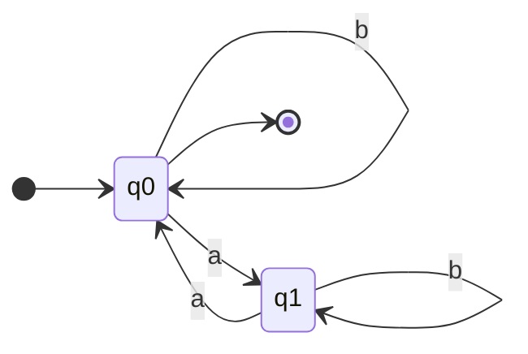
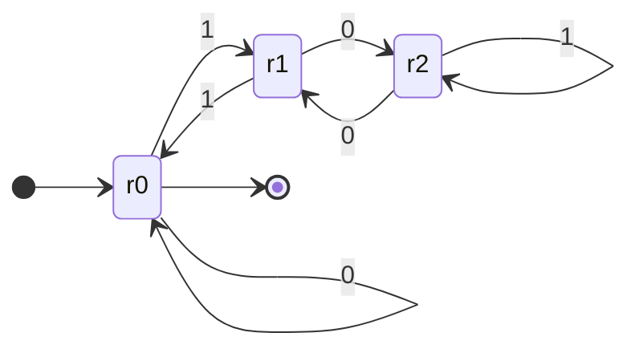
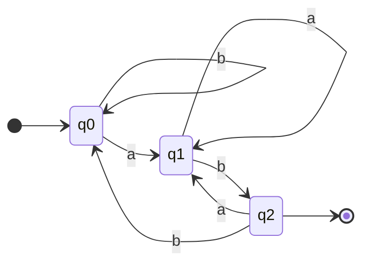
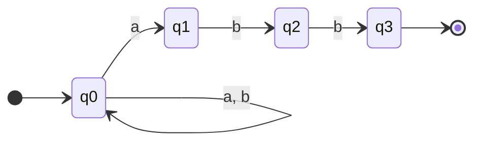
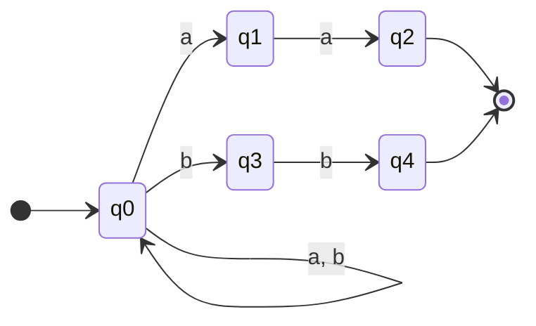
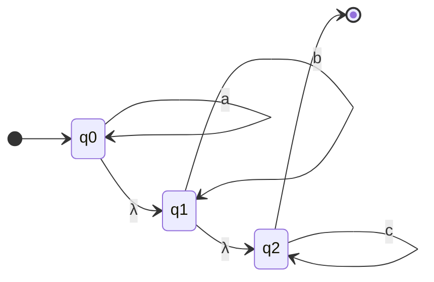

# Actividad 6. Implementación de AFD y AFND

**Nombre de la actividad:** Actividad 6. Implementación de AFD y AFND  
**Materia:** Lenguajes Computacionales

## Equipo de trabajo

| Nombre completo | No. de cuenta |
|---|---|
| Jonathan Hernández Lazcano | 200417 |
| Camila Rodriguez Rosas | 194100 |

## Descripción

API construida con FastAPI que expone dos evaluadores de cadenas: uno para **autómatas finitos
deterministas (AFD)** y otro para **autómatas finitos no deterministas (AFND)**, este último con
soporte para **transiciones λ**.

Cada evaluador recibe una **tabla de transición** y una o varias **cadenas a evaluar**, y devuelve:

- Estados totales (Q)
- Alfabeto (Σ)
- Estado inicial (q₀)
- Estado(s) finales (F)
- El resultado de cada cadena, **incluyendo la notación de transición** del recorrido

Los estados, el alfabeto y el tipo de autómata no se piden como parámetro: se **derivan** de la
tabla de transición.

## Cómo ejecutar

```bash
python3 -m venv .venv
source .venv/bin/activate
pip install -r requirements.txt

# Levantar la API (documentación interactiva en http://127.0.0.1:8000/docs)
uvicorn main:app --reload

# Ejecutar el notebook con el desarrollo de los ejercicios
jupyter nbconvert --execute --to notebook --inplace notebooks/ejercicios.ipynb
# o abrirlo interactivamente:
jupyter notebook notebooks/ejercicios.ipynb
```

## Endpoints

| Endpoint | Descripción |
|---|---|
| `GET /` | Verificación de estado de la API |
| `POST /afd/evaluar` | Evalúa cadenas sobre un AFD |
| `POST /afnd/evaluar` | Evalúa cadenas sobre un AFND (con o sin transiciones λ) |

### Formato de la petición

Ambos endpoints reciben el mismo cuerpo:

| Campo | Tipo | Descripción |
|---|---|---|
| `tabla` | objeto | Tabla de transición: `estado → símbolo → destino(s)` |
| `estado_inicial` | texto | Estado por el que comienza el recorrido |
| `estados_finales` | lista | Estados de aceptación |
| `cadenas` | lista | Cadenas a evaluar (`""` representa λ) |

En el **AFD** cada celda es un solo estado (`"q1"`); en el **AFND** es una lista de estados
(`["q1", "q2"]`). Una celda ausente o vacía significa transición indefinida.

```jsonc
// AFD
{ "tabla": { "q0": {"a": "q1", "b": "q0"} }, ... }

// AFND (la columna λ es opcional y no forma parte del alfabeto)
{ "tabla": { "q0": {"a": ["q0", "q1"], "λ": ["q2"]} }, ... }
```

La columna λ puede escribirse como `"λ"`, `"lambda"`, `"ε"` o `""`; todas se normalizan a `λ`.

### Notación de transición

Los dos evaluadores documentan el recorrido, pero con la notación propia de cada modelo:

| Autómata | Notación | Ejemplo |
|---|---|---|
| AFD | Configuraciones `(estado, resto)` unidas por `⊢` | `(q0, ab) ⊢ (q1, b) ⊢ (q2, λ)` |
| AFND | Conjuntos de estados por paso | `{q0} --a--> {q0, q1} --b--> {q0, q2}` |

Además, cuando un AFND acepta la cadena, la respuesta incluye `camino_aceptacion`: **un** camino
concreto que la acepta (`q0 --a--> q1 --b--> q2`), incluidos los saltos `--λ-->`.

El símbolo `∅` en la notación marca el punto exacto donde el recorrido se detuvo, ya sea por una
transición indefinida o por un símbolo ajeno al alfabeto.

## Ejercicios

Los resultados de esta sección son la salida literal de los endpoints; el desarrollo completo,
paso a paso, está en [`notebooks/ejercicios.ipynb`](notebooks/ejercicios.ipynb).

### Ejercicio 1 (AFD) — Cadenas con un número par de `a`

`Σ = {a, b}` &nbsp;·&nbsp; `L = { w ∈ Σ* : w tiene una cantidad par de a }`

El estado guarda la paridad de las `a` leídas: **q0** = par (aceptación), **q1** = impar. Las `b` no cambian la paridad, por eso son bucles.

**Tabla de transición** &nbsp;(`→` estado inicial, `*` estado de aceptación)

| δ | a | b |
|---|---|---|
| → \* **q0** | q1 | q0 |
| q1 | q0 | q1 |



**Petición**

```json
{
  "tabla": {
    "q0": {
      "a": "q1",
      "b": "q0"
    },
    "q1": {
      "a": "q0",
      "b": "q1"
    }
  },
  "estado_inicial": "q0",
  "estados_finales": [
    "q0"
  ],
  "cadenas": [
    "",
    "a",
    "aa",
    "ba",
    "abab",
    "aaa",
    "bbb"
  ]
}
```

**Respuesta del endpoint**

| Dato | Valor |
|---|---|
| Estados totales (Q) | {q0, q1} |
| Alfabeto (Σ) | {a, b} |
| Estado inicial (q₀) | q0 |
| Estados finales (F) | {q0} |
| Tipo detectado | AFD |

| Cadena | ¿Aceptada? | Notación de transición |
|---|:--:|---|
| `λ` | ✅ Sí | `(q0, λ)` |
| `a` | ❌ No | `(q0, a) ⊢ (q1, λ)` |
| `aa` | ✅ Sí | `(q0, aa) ⊢ (q1, a) ⊢ (q0, λ)` |
| `ba` | ❌ No | `(q0, ba) ⊢ (q0, a) ⊢ (q1, λ)` |
| `abab` | ✅ Sí | `(q0, abab) ⊢ (q1, bab) ⊢ (q1, ab) ⊢ (q0, b) ⊢ (q0, λ)` |
| `aaa` | ❌ No | `(q0, aaa) ⊢ (q1, aa) ⊢ (q0, a) ⊢ (q1, λ)` |
| `bbb` | ✅ Sí | `(q0, bbb) ⊢ (q0, bb) ⊢ (q0, b) ⊢ (q0, λ)` |

---

### Ejercicio 2 (AFD) — Números binarios múltiplos de 3

`Σ = {0, 1}` &nbsp;·&nbsp; `L = { w ∈ Σ* : w leído en binario es múltiplo de 3 }`

Cada estado es el residuo módulo 3 del número leído hasta ese punto. Al leer un bit *b* el número se duplica y se le suma el bit, así que `δ(rᵢ, b) = r₍₂ᵢ₊b₎ mod 3`.

**Tabla de transición** &nbsp;(`→` estado inicial, `*` estado de aceptación)

| δ | 0 | 1 |
|---|---|---|
| → \* **r0** | r0 | r1 |
| r1 | r2 | r0 |
| r2 | r1 | r2 |



**Petición**

```json
{
  "tabla": {
    "r0": {
      "0": "r0",
      "1": "r1"
    },
    "r1": {
      "0": "r2",
      "1": "r0"
    },
    "r2": {
      "0": "r1",
      "1": "r2"
    }
  },
  "estado_inicial": "r0",
  "estados_finales": [
    "r0"
  ],
  "cadenas": [
    "0",
    "10",
    "11",
    "110",
    "101",
    "1001",
    "1111"
  ]
}
```

**Respuesta del endpoint**

| Dato | Valor |
|---|---|
| Estados totales (Q) | {r0, r1, r2} |
| Alfabeto (Σ) | {0, 1} |
| Estado inicial (q₀) | r0 |
| Estados finales (F) | {r0} |
| Tipo detectado | AFD |

| Cadena | ¿Aceptada? | Notación de transición |
|---|:--:|---|
| `0` | ✅ Sí | `(r0, 0) ⊢ (r0, λ)` |
| `10` | ❌ No | `(r0, 10) ⊢ (r1, 0) ⊢ (r2, λ)` |
| `11` | ✅ Sí | `(r0, 11) ⊢ (r1, 1) ⊢ (r0, λ)` |
| `110` | ✅ Sí | `(r0, 110) ⊢ (r1, 10) ⊢ (r0, 0) ⊢ (r0, λ)` |
| `101` | ❌ No | `(r0, 101) ⊢ (r1, 01) ⊢ (r2, 1) ⊢ (r2, λ)` |
| `1001` | ✅ Sí | `(r0, 1001) ⊢ (r1, 001) ⊢ (r2, 01) ⊢ (r1, 1) ⊢ (r0, λ)` |
| `1111` | ✅ Sí | `(r0, 1111) ⊢ (r1, 111) ⊢ (r0, 11) ⊢ (r1, 1) ⊢ (r0, λ)` |

---

### Ejercicio 3 (AFD) — Cadenas que terminan en `ab`

`Σ = {a, b}` &nbsp;·&nbsp; `L = { w·ab : w ∈ Σ* }`

El estado recuerda cuánto del sufijo `ab` se lleva reconocido. Desde **q2** una `a` regresa a **q1** y no a **q0**, porque esa misma `a` puede iniciar un nuevo sufijo.

**Tabla de transición** &nbsp;(`→` estado inicial, `*` estado de aceptación)

| δ | a | b |
|---|---|---|
| → **q0** | q1 | q0 |
| q1 | q1 | q2 |
| \* **q2** | q1 | q0 |



**Petición**

```json
{
  "tabla": {
    "q0": {
      "a": "q1",
      "b": "q0"
    },
    "q1": {
      "a": "q1",
      "b": "q2"
    },
    "q2": {
      "a": "q1",
      "b": "q0"
    }
  },
  "estado_inicial": "q0",
  "estados_finales": [
    "q2"
  ],
  "cadenas": [
    "ab",
    "aab",
    "abb",
    "bab",
    "a",
    "abab",
    "ba"
  ]
}
```

**Respuesta del endpoint**

| Dato | Valor |
|---|---|
| Estados totales (Q) | {q0, q1, q2} |
| Alfabeto (Σ) | {a, b} |
| Estado inicial (q₀) | q0 |
| Estados finales (F) | {q2} |
| Tipo detectado | AFD |

| Cadena | ¿Aceptada? | Notación de transición |
|---|:--:|---|
| `ab` | ✅ Sí | `(q0, ab) ⊢ (q1, b) ⊢ (q2, λ)` |
| `aab` | ✅ Sí | `(q0, aab) ⊢ (q1, ab) ⊢ (q1, b) ⊢ (q2, λ)` |
| `abb` | ❌ No | `(q0, abb) ⊢ (q1, bb) ⊢ (q2, b) ⊢ (q0, λ)` |
| `bab` | ✅ Sí | `(q0, bab) ⊢ (q0, ab) ⊢ (q1, b) ⊢ (q2, λ)` |
| `a` | ❌ No | `(q0, a) ⊢ (q1, λ)` |
| `abab` | ✅ Sí | `(q0, abab) ⊢ (q1, bab) ⊢ (q2, ab) ⊢ (q1, b) ⊢ (q2, λ)` |
| `ba` | ❌ No | `(q0, ba) ⊢ (q0, a) ⊢ (q1, λ)` |

---

### Ejercicio 4 (AFND) — El lenguaje `(a|b)*abb`

`Σ = {a, b}` &nbsp;·&nbsp; `L = L((a|b)*abb)`

El no determinismo está en `δ(q0, a) = {q0, q1}`: al leer una `a` el autómata puede quedarse en **q0** (esa `a` es parte del prefijo cualquiera) o *apostar* a que ahí empieza el sufijo `abb`. Como la evaluación explora todas las ramas a la vez, basta con que **una** llegue a **q3**.

**Tabla de transición** &nbsp;(`→` estado inicial, `*` estado de aceptación)

| δ | a | b |
|---|---|---|
| → **q0** | {q0, q1} | {q0} |
| q1 | ∅ | {q2} |
| q2 | ∅ | {q3} |
| \* **q3** | ∅ | ∅ |



**Petición**

```json
{
  "tabla": {
    "q0": {
      "a": [
        "q0",
        "q1"
      ],
      "b": [
        "q0"
      ]
    },
    "q1": {
      "b": [
        "q2"
      ]
    },
    "q2": {
      "b": [
        "q3"
      ]
    },
    "q3": {}
  },
  "estado_inicial": "q0",
  "estados_finales": [
    "q3"
  ],
  "cadenas": [
    "abb",
    "aabb",
    "babb",
    "ab",
    "abba",
    "bb"
  ]
}
```

**Respuesta del endpoint**

| Dato | Valor |
|---|---|
| Estados totales (Q) | {q0, q1, q2, q3} |
| Alfabeto (Σ) | {a, b} |
| Estado inicial (q₀) | q0 |
| Estados finales (F) | {q3} |
| Tipo detectado | AFND |

| Cadena | ¿Aceptada? | Notación de transición | Camino de aceptación |
|---|:--:|---|---|
| `abb` | ✅ Sí | `{q0} --a--> {q0, q1} --b--> {q0, q2} --b--> {q0, q3}` | `q0 --a--> q1 --b--> q2 --b--> q3` |
| `aabb` | ✅ Sí | `{q0} --a--> {q0, q1} --a--> {q0, q1} --b--> {q0, q2} --b--> {q0, q3}` | `q0 --a--> q0 --a--> q1 --b--> q2 --b--> q3` |
| `babb` | ✅ Sí | `{q0} --b--> {q0} --a--> {q0, q1} --b--> {q0, q2} --b--> {q0, q3}` | `q0 --b--> q0 --a--> q1 --b--> q2 --b--> q3` |
| `ab` | ❌ No | `{q0} --a--> {q0, q1} --b--> {q0, q2}` | — |
| `abba` | ❌ No | `{q0} --a--> {q0, q1} --b--> {q0, q2} --b--> {q0, q3} --a--> {q0, q1}` | — |
| `bb` | ❌ No | `{q0} --b--> {q0} --b--> {q0}` | — |

---

### Ejercicio 5 (AFND) — Cadenas que terminan en `aa` o en `bb`

`Σ = {a, b}` &nbsp;·&nbsp; `L = { w·aa : w ∈ Σ* } ∪ { w·bb : w ∈ Σ* }`

Desde **q0** salen dos ramas independientes: `q1 → q2` verifica el sufijo `aa` y `q3 → q4` el sufijo `bb`. Es el patrón típico para expresar una **unión** con un AFND: las dos máquinas se ponen en paralelo y el estado inicial adivina cuál usar.

**Tabla de transición** &nbsp;(`→` estado inicial, `*` estado de aceptación)

| δ | a | b |
|---|---|---|
| → **q0** | {q0, q1} | {q0, q3} |
| q1 | {q2} | ∅ |
| \* **q2** | ∅ | ∅ |
| q3 | ∅ | {q4} |
| \* **q4** | ∅ | ∅ |



**Petición**

```json
{
  "tabla": {
    "q0": {
      "a": [
        "q0",
        "q1"
      ],
      "b": [
        "q0",
        "q3"
      ]
    },
    "q1": {
      "a": [
        "q2"
      ]
    },
    "q2": {},
    "q3": {
      "b": [
        "q4"
      ]
    },
    "q4": {}
  },
  "estado_inicial": "q0",
  "estados_finales": [
    "q2",
    "q4"
  ],
  "cadenas": [
    "aa",
    "bb",
    "abaa",
    "abb",
    "ab",
    "b",
    "baab"
  ]
}
```

**Respuesta del endpoint**

| Dato | Valor |
|---|---|
| Estados totales (Q) | {q0, q1, q2, q3, q4} |
| Alfabeto (Σ) | {a, b} |
| Estado inicial (q₀) | q0 |
| Estados finales (F) | {q2, q4} |
| Tipo detectado | AFND |

| Cadena | ¿Aceptada? | Notación de transición | Camino de aceptación |
|---|:--:|---|---|
| `aa` | ✅ Sí | `{q0} --a--> {q0, q1} --a--> {q0, q1, q2}` | `q0 --a--> q1 --a--> q2` |
| `bb` | ✅ Sí | `{q0} --b--> {q0, q3} --b--> {q0, q3, q4}` | `q0 --b--> q3 --b--> q4` |
| `abaa` | ✅ Sí | `{q0} --a--> {q0, q1} --b--> {q0, q3} --a--> {q0, q1} --a--> {q0, q1, q2}` | `q0 --a--> q0 --b--> q0 --a--> q1 --a--> q2` |
| `abb` | ✅ Sí | `{q0} --a--> {q0, q1} --b--> {q0, q3} --b--> {q0, q3, q4}` | `q0 --a--> q0 --b--> q3 --b--> q4` |
| `ab` | ❌ No | `{q0} --a--> {q0, q1} --b--> {q0, q3}` | — |
| `b` | ❌ No | `{q0} --b--> {q0, q3}` | — |
| `baab` | ❌ No | `{q0} --b--> {q0, q3} --a--> {q0, q1} --a--> {q0, q1, q2} --b--> {q0, q3}` | — |

---

### Ejercicio 6 (AFND-λ) — El lenguaje `a*b*c*`

`Σ = {a, b, c}` &nbsp;·&nbsp; `L = L(a*b*c*)`

Cada estado es el bucle de un bloque (**q0** para las `a`, **q1** para las `b`, **q2** para las `c`) y las **transiciones λ** conectan un bloque con el siguiente sin consumir símbolos. Gracias a ellas cualquier bloque puede quedar vacío: la clausura-λ de {q0} es {q0, q1, q2}, y como **q2** es de aceptación, la cadena vacía se acepta sin leer nada.

**Tabla de transición** &nbsp;(`→` estado inicial, `*` estado de aceptación)

| δ | a | b | c | λ |
|---|---|---|---|---|
| → **q0** | {q0} | ∅ | ∅ | {q1} |
| q1 | ∅ | {q1} | ∅ | {q2} |
| \* **q2** | ∅ | ∅ | {q2} | ∅ |



**Petición**

```json
{
  "tabla": {
    "q0": {
      "a": [
        "q0"
      ],
      "λ": [
        "q1"
      ]
    },
    "q1": {
      "b": [
        "q1"
      ],
      "λ": [
        "q2"
      ]
    },
    "q2": {
      "c": [
        "q2"
      ]
    }
  },
  "estado_inicial": "q0",
  "estados_finales": [
    "q2"
  ],
  "cadenas": [
    "",
    "aaa",
    "aabbcc",
    "ac",
    "bc",
    "abc",
    "ba",
    "cba"
  ]
}
```

**Respuesta del endpoint**

| Dato | Valor |
|---|---|
| Estados totales (Q) | {q0, q1, q2} |
| Alfabeto (Σ) | {a, b, c} |
| Estado inicial (q₀) | q0 |
| Estados finales (F) | {q2} |
| Tipo detectado | AFND-λ |

| Cadena | ¿Aceptada? | Notación de transición | Camino de aceptación |
|---|:--:|---|---|
| `λ` | ✅ Sí | `{q0, q1, q2}` | `q0 --λ--> q1 --λ--> q2` |
| `aaa` | ✅ Sí | `{q0, q1, q2} --a--> {q0, q1, q2} --a--> {q0, q1, q2} --a--> {q0, q1, q2}` | `q0 --a--> q0 --a--> q0 --a--> q0 --λ--> q1 --λ--> q2` |
| `aabbcc` | ✅ Sí | `{q0, q1, q2} --a--> {q0, q1, q2} --a--> {q0, q1, q2} --b--> {q1, q2} --b--> {q1, q2} --c--> {q2} --c--> {q2}` | `q0 --a--> q0 --a--> q0 --λ--> q1 --b--> q1 --b--> q1 --λ--> q2 --c--> q2 --c--> q2` |
| `ac` | ✅ Sí | `{q0, q1, q2} --a--> {q0, q1, q2} --c--> {q2}` | `q0 --a--> q0 --λ--> q1 --λ--> q2 --c--> q2` |
| `bc` | ✅ Sí | `{q0, q1, q2} --b--> {q1, q2} --c--> {q2}` | `q0 --λ--> q1 --b--> q1 --λ--> q2 --c--> q2` |
| `abc` | ✅ Sí | `{q0, q1, q2} --a--> {q0, q1, q2} --b--> {q1, q2} --c--> {q2}` | `q0 --a--> q0 --λ--> q1 --b--> q1 --λ--> q2 --c--> q2` |
| `ba` | ❌ No | `{q0, q1, q2} --b--> {q1, q2} --a--> ∅` | — |
| `cba` | ❌ No | `{q0, q1, q2} --c--> {q2} --b--> ∅` | — |

---

## Validaciones

La API distingue dos niveles de error:

**1. Errores de definición del autómata** → `HTTP 422`, no se evalúa ninguna cadena.

| Caso | Mensaje |
|---|---|
| Tabla vacía | `La tabla de transición está vacía.` |
| Estado inicial inexistente | `El estado inicial 'qX' no aparece en la tabla de transición.` |
| Estado final inexistente | `Estado(s) final(es) que no aparecen en la tabla de transición: qZ` |
| AFD con dos destinos en una celda | `Un AFD debe tener a lo más un destino por celda; hay varios en: δ(q0, a)` |
| AFD con transición λ | `Un AFD no admite transiciones λ; usa el endpoint /afnd/evaluar.` |

**2. Problemas de una cadena concreta** → solo esa cadena se rechaza, con su motivo; las demás del
lote se evalúan con normalidad.

Con el AFD incompleto `q0: {a → q1}`, `q1: {a → q1, b → q1}` (inicial `q0`, final `q1`):

| Cadena | ¿Aceptada? | Notación de transición | Motivo |
|---|:--:|---|---|
| `ba` | ❌ No | `(q0, ba) ⊢ (∅, a)` | No hay transición definida para δ(q0, b). |
| `aab` | ✅ Sí | `(q0, aab) ⊢ (q1, ab) ⊢ (q1, b) ⊢ (q1, λ)` | Termina en q1, que es un estado de aceptación. |
| `abc` | ❌ No | `(q0, abc) ⊢ (q1, bc) ⊢ (q1, c) ⊢ (∅, λ)` | El símbolo 'c' no pertenece al alfabeto Σ = {a, b}. |